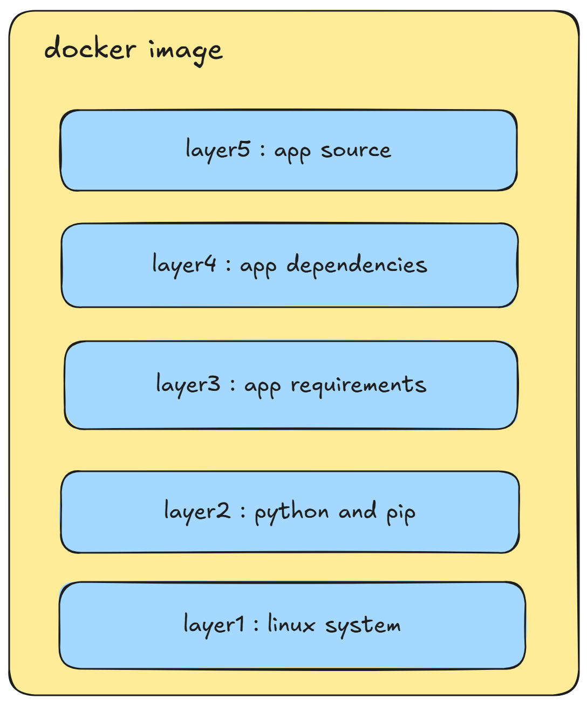

+++
date = '2025-09-02T23:58:21+08:00'
draft = false
title = 'Docker镜像解析'
tags = ["Docker", "镜像"]
+++

## 基础概念
Docker 镜像的本质是一个轻量级、可执行的、独立的文件包，它包含了运行一个特定应用所需的一切，包括：
- 应用程序代码
- 运行时环境（如 Java、Python、Node.js）
- 库文件
- 环境变量
- 配置文件

你可以把它想象成一个“***只读的模板***”或“***快照***”。这个模板可以被用来创建 Docker 容器。每个容器都是一个基于该镜像的独立运行实例，并且它们之间相互***隔离***。

---

## 特点
- ***分层存储***：

    这是 Docker 镜像最核心的概念。镜像不是一个单一的巨大文件，而是由多个只读的文件层（layers）叠加而成。每一层都代表对镜像的一次修改。

    这样分层的好处是可以高效利用存储空间，不同的镜像可以共享相同的镜像层，避免重复存储。
- ***只读不可变***：

    镜像本身是不可变的。镜像构建时，会一层层构建，前一层是后一层的基础。每一层构建完就不会再发生改变，后一层上的任何改变只发生在自己这一层。当我们从一个镜像启动一个容器时，Docker 会在镜像的顶部创建一个新的可写的层。所有对容器的修改都发生在这个可写层上，而不会影响到原始镜像。这确保了镜像的“模板”性质，无论你启动多少个容器，它们的基础都是一致的。

---

## 详细架构

以上是一个可能的docker镜像的结构。

最底层是一个linux系统的镜像。

第二层在系统镜像之上安装了python运行时环境和用来管理依赖的pip。

第三层存放应用程序特定的requirements.txt 文件。

第四层存放该应用程序的特定依赖项。

第五层存放应用程序的实际源代码。

---

## 参考
1. <https://docs.docker.com/get-started/docker-concepts/building-images/understanding-image-layers/>
2. <https://yeasy.gitbook.io/docker_practice/basic_concept/image>

