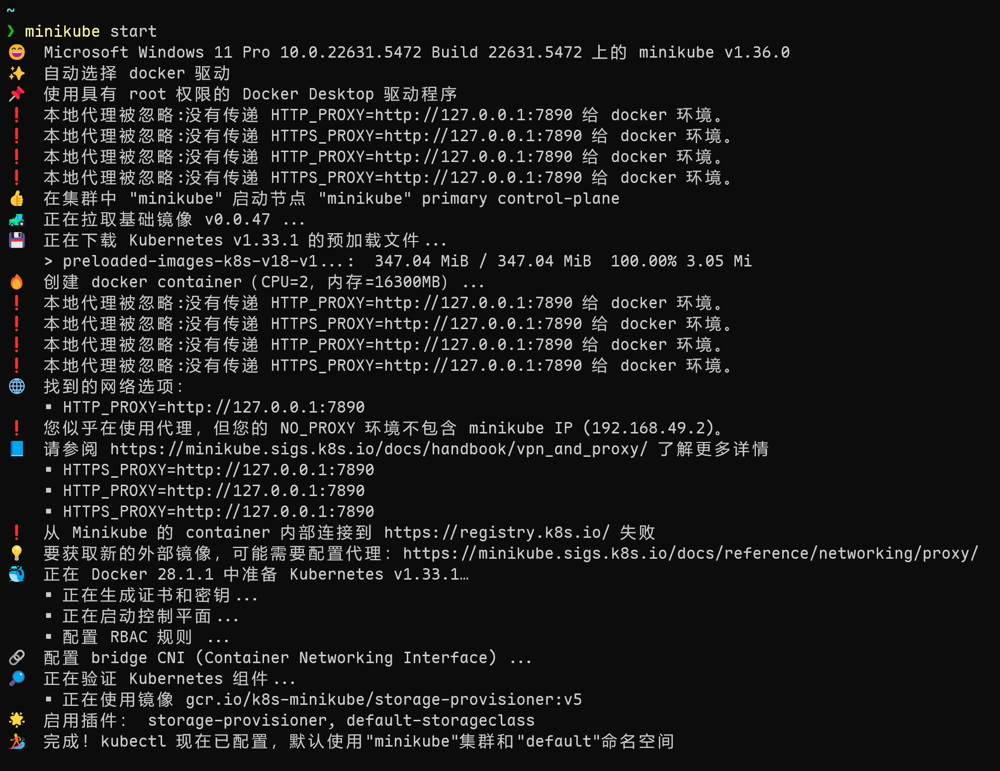
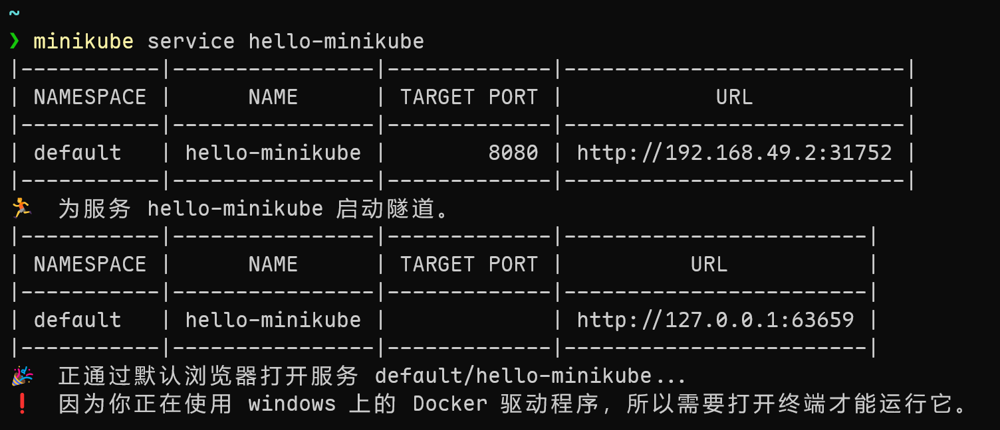
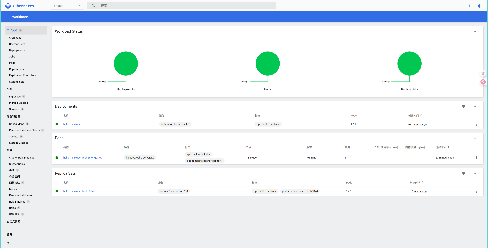

+++
date = '2025-09-06T14:32:40+08:00'
draft = false
title = 'Minikube安装k8s'
tags = ["k8s"]
+++

## 安装minikube
运行环境： Windows
```shell
winget install Kubernetes.minikube
```


---

## 启动k8s集群
原本是打算在WSL2中启动minikube，但是遇到一些奇怪的问题尚未解决，github上找到具体issue [minikube issues](https://github.com/kubernetes/minikube/issues?q=is%3Aissue%20state%3Aclosed%20docker.service%20is%20masked.)。虽然情况类似，但是依然没有找到合适的解决方案。

所以选择在windows上启动，然后过程异常顺利。

```shell
## 启动集群
minikube start
```


下载minikube的时候会自动携带下载kubectl。

```shell
## 获取所有pods
kubectl get po -A
```


```shell
## 创建deployment并暴露端口8080
kubectl create deployment hello-minikube --image=kicbase/echo-server:1.0
kubectl expose deployment hello-minikube --type=NodePort --port=8080

## 获取deployment信息
kubectl get services hello-minikube
```


```shell
## 访问hello-minikube service
minikube service hello-minikube
```


同时浏览器会自动打开页面，输出以下内容。


到此我们就成功使用minikube启动k8s，同时创建应用并访问它。

同时我们可以通过监控面板来观察k8s集群的状态。
```shell
minikube dashboard
```


---

## 参考
1. [minikube-start](https://minikube.sigs.k8s.io/docs/start/?arch=%2Fwindows%2Fx86-64%2Fstable%2Fwindows+package+manager#Service)